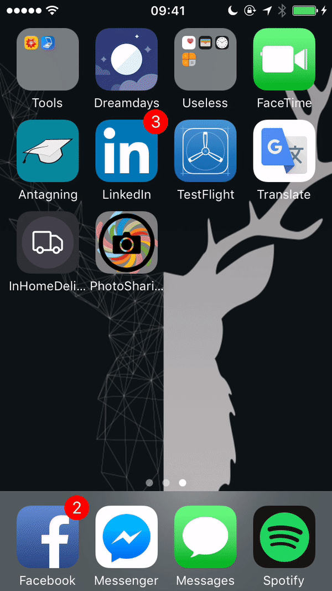

# PhotoFullStack

## What is this?
PhotoFullStack is a photo application which consists of a back-end built in Go using MongoDB and two front-end applications built for Android (using Java) and iOS (using Swift). The main goal of this project is to learn how to build (and maintain) a fullstack application, from the database and backend, to the iOS/Android app frontend. The backend was built by Gustave and Oskar, with a strong intention on using the standard library in Go as much as possible, and not relying on any frameworks. 

The features of the application are displaying, adding and removing a user's photos and login functionality.

## How to use
### Backend
Install MongoDB and create a database called `main` with a collection `users` which has a unique field `username`. Install Go and run the file `main.go` to start the backend. The backend will listen on port `8080`.

### Android
Install the APK file `photofullstack.apk` in the `android/` folder. Run it and connect to the IP and port that the backend is running on. Type in your username and click `Register`, then you can log in. Use the camera or the gallery to upload photos, the icons are in the top right corner when logged in.

### iOS 
(Can only run on OSX) Make sure you have Cocoapods install, then open the terminal and move to the root directory of the iOS app (name PhotoSharingApp), and run `pod install`. Then, once all of the pods are installed, open the .xcworkspace file. Choose a simulator or connect your iPhone, and press CMD+R.

## Demos 
Here are some videos of the iOS app in action. The Android app has the same functionality. 

## Testing
Unit testing will be used thoroughly for the development of the back-end, where we will be using the Go `testing` package. The front-end applications are a bit harder to test properly, and will be tested and debugged while using the applications.

## Project Overview / Roadmap 

