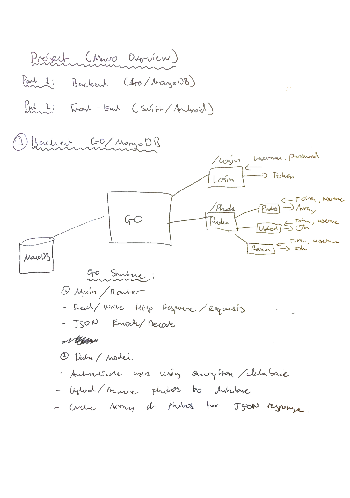
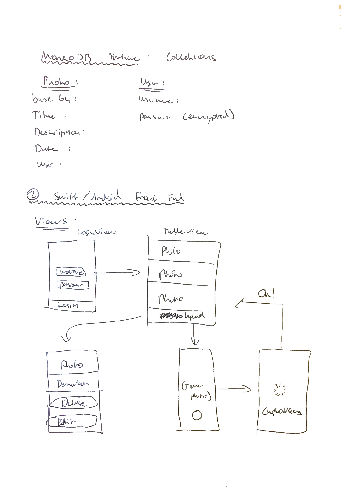

# PhotoFullStack

## What is this?
PhotoFullStack is a photo application which consists of a back-end built in Go using MongoDB and two front-end applications built for Android (using Java) and iOS (using Swift). The main goal of this project is to learn how to build (and maintain) a fullstack application, from the database and backend, to the iOS/Android app frontend. The backend was built by Gustave and Oskar, with a strong intention on using the standard library in Go as much as possible, and not relying on any frameworks. 

The features of the application are displaying, adding and removing a user's photos and login functionality.

## How to use
This will be updated as the project evolves.

## Testing
Unit testing will be used thoroughly for the development of the back-end, where we will be using the Go `testing` package. The front-end applications are a bit harder to test properly, and will be tested and debugged while using the applications.

## Project Overview / Roadmap 

